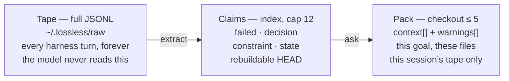
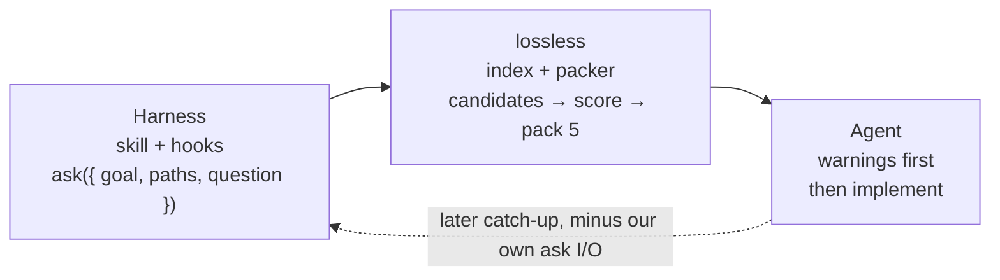
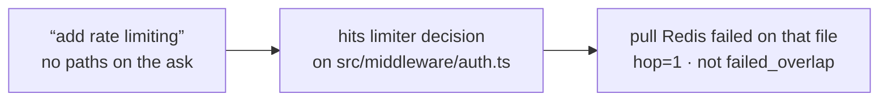

# Algorithm

How retrieve picks five records.

The chat window is lossy. The session tape is not. lossless copies that tape, extracts a small index of durable claims, and on each `ask` checks out at most five of them for *this* goal and these files. No LLM on retrieve. Age never disqualifies a claim. Dense vectors are optional and unused in the live store today.

[Architecture](architecture.md) · [retrieval.md](retrieval.md) · [write.md](write.md)

## 1. Three layers

Same shape as git or a log stream: keep the objects, build indexes, check out a few records. Do not paste the stream into the next prompt.



Hooks write the tape. Extract indexes. `ask` is the checkout, not grep, not a summary.

## 2. Three jobs, in this order

Fusion weights exist to express this order. They do not replace it. A prettier cosine hit in another file cannot beat a failed on the path you named.

| Job 1 · 4.0 | Job 2 · 2.5 | Job 3 · mix |
|-------------|-------------|-------------|
| Do not repeat failed work | Do not regress shipped work | Answer the question |
| Redis limiter already burned in staging | jose, not jsonwebtoken, for Edge | Path, symbol, FTS, optional vectors |
| `failed_overlap = 1` forces pack + warning | Standing constraints (never log Authorization) | Profile mix: path / ident / prose / HEAD |
| Packed first, before the type cap can starve it | `shipped_overlap = 1` warns | Cannot outrank jobs 1–2 |

## 3. The loop

Write is push. Read is pull. The harness decides when to ask. lossless only packs. The agent obeys warnings.



Claims are `owner/repo` across Grok, Claude, Codex. Served / dwell / continue is only the asking session.

The model does not write a search query. It sends current work. lossless compiles lookups.

## 4. Write: tape first, then a thin index

Catch-up is fail-open. Ingest is picky on purpose. Extract is allowed to drop almost everything; the tape still has the sentence.

1. **Ingest the session file.** Hook or watcher. `Lstat` then `O_NOFOLLOW`. Must be a regular `.jsonl`, size-capped. No `/etc/passwd`, no swapped symlink. Copy into `~/.lossless/raw/<owner>__<repo>/`.
2. **Parse harness JSONL.** Grok / Claude / Codex / Pi / OpenCode. Skip system and developer roles. Skip nested `tool_result`. Skip own ask payloads (`looksLikeOwnPayload`). Clip lines over 8k instead of dropping the tail.
3. **Extract durable sentences.** Classify after `Fold` (curly apostrophes). Skip slogans, I'll-run / I'll-rerun / I'll-patch narration, operator intended-gap / hyphenated I'll-run / same-failure, pauses-as-no-progress, truncated chopped file-fragments (`e_test.go …`, not a real `concurrent_test.go-first` failed — `.go-first` is one sentence) / yaml-ish `tree:` dumps / trailing chopped `0.1.` (not standing `4.0.` / `2.5.`) / unclosed-paren count (not a closed `(timeout)` or standing `4.0.`), extract-meta (`still extracts;` / `still extracts.` / `still stores.` / `still stores;` / `still store:` / `still keep.` / `still ground.` with no object — "and pack" is not required — hyphenated still-store, hyphenated They-found lock-list, lock-list recap mash, recap-checkout, contains-skipped keep-talk, lock the recap row, recap-as-failed, loop residue / the product keep is, inspect-recap, gates-mostly-match, go-first mash, ok=false), example-drop recaps after list-marker and quote trim, chopped never-lose-memo, inspect-status recaps (`Live recent N are` / `Inspect recent on`, `recent_noise=` dumps, clock-time recap ids, recap-faileds in the recent window), JSON dumps, and live-residue recap. ProcessState leftovers skip only as type=state, not SkipProse, so a They-found Redis/path failed that contains `in this session` still stores. Do not contains-skip named-lock claims or `they found`. `They found X: a, b, and c` is a review list; hyphenated They-found comma-lists skip; a They-found + Redis/path failed still stores. `I'll stick with JWT next` still stores. A `concurrent_test.go-first` failed is not a go-first mash. Space-form "same failure twice" is not a skip (a real job-1 Redis failed still stores). `failed` only if grounded (path, tick, or proper noun) and not meta-talk. `Same` / `Tests` / `Live` / `Ask` / `They` / `One` / `Bench` are sentence starters, not identifiers. Pathless `Tests failed to` still grounds. Pathless Bench against testdata does not. Pathful Bench and `Failed to` / `Failure during` still ground. Standing `4.0` is not a skip. Paths are per-sentence plus the last few *user* turns, not the whole assistant message. Nearby does not glue `auth.ts` onto a later decoy.
4. **Cap 12, pathful first.** At most 5 per type. Failed dir-cap 2; decision/constraint dir-cap 5. `FilterPaths` drops abs/`~`/drive/`..`, `.git`, `node_modules`, keys, percent-encoded traversal. Leading-dot dirs like `.github` stay.

## 5. Ask pipeline

One MCP/REST call. Target p50 < 500ms, p95 < 2s at 10k claims. Never scan the full project table.

1. **catch-up this session** — fail-open. If `session_id` is set and the store already has that session, copy complete lines the index has not ingested. If `session_id` is set but unknown, exact locate of that id only (Codex/Pi without cwd, so they cannot fall back to newest-mtime). If `session_id` is omitted, catch-up stored sessions for this workspace that are behind. Do not walk a harness home for newest mtime.
2. **normalize** — `project_key`, question/goal tokens, path keys + basename, identifier symbols. Rich if a path is set or there are ≥2 tokens. Rich asks are never overwritten.
3. **compile if thin, then hydrate** — empty question + goal: last 40 messages / 32k chars fill the query. Then load this session’s served / dwell / continue tape. Claims are shared by project; the action tape is this session only.
4. **candidates · union · cap 400** — FTS ∪ path ∪ symbol ∪ failed/decision/constraint. Pathless asks hop through files the first hits named. Empty union: last 8 faileds. Optional kNN if an embedder is attached.
5. **drop** — extract-noise, fixture sessions, older same-path conflicts, decisions invalidated by a newer same-file failed on topic tokens (paths stripped).
6. **features + score** — no LLM. Sacred 4.0 failed-overlap + 2.5 shipped-overlap, then a path/ident/prose/HEAD mix.
7. **pack 5 · type-cap 2 · warnings** — force the best job-1 failed first. Then coverage, then score. Blocking warnings on the packed hits.

## 6. Candidate generation

Recall-oriented union. Structure first. Vectors only if an on-box embedder is attached. Live home runs with embedder none.

| Source | Cap | When |
|--------|-----|------|
| FTS | 80 | lookup tokens vs claim text + symbols |
| Path | 40 / path, 80 total | caller files + basename |
| Symbol | 40 / symbol, 80 total | `jose`, `tokenBucket`. Not `library`. |
| Failed / decision / constraint | 40 each | path or symbol overlap |
| Inferred path (two-hop) | 6 paths, 24 / type | pathless only: first hits name files, pull job 1–2 on those files |
| Recent faileds | 8 | only if the union is still empty |
| Vector kNN | 120 | optional. skip if no embedder |

Pathless two-hop:



Hop finds the row. It does not mark every failed on `auth.ts` as “do not repeat.” Caller path still empty on the action tape. Warehouse timeouts on another file stay out.

Then: drop extract-noise and fixtures · keep newest hash · drop older same-path conflicts (Jaccard ≥ 0.35) · drop decisions invalidated by a newer same-file failed on *topic* tokens (paths stripped, Jaccard ≥ 0.2).

## 7. Features and score

Computed only on candidates. Weights scale these features, not raw counts of faileds. Same idea as X’s “weight × P(action)”, not “1 report = 468 likes.”

| Feature | Range | Meaning |
|---------|-------|---------|
| `type_rank` | 0–5 | failed 5 · decision 4 · constraint 3 · state 2 |
| `recency` | 0–1 | 0.5^(age / half-life). Constraint does not fade. Decision 180d. Failed 14d. State 7d. |
| `path` | 0–1 | Jaccard of *caller* paths vs claim paths |
| `hop` | 0–1 | Jaccard vs inferred files. Pack eligibility only, not job 1 |
| `symbol` / `bm25` / `vector` | 0–1 | vector is 0 if embedder is none |
| `agree` | 0–1 | (FTS + path + symbol) / 3 |
| `failed_overlap` | 0 or 1 | failed *and* strong overlap → warning |
| `shipped_overlap` | 0 or 1 | decision / constraint / state and strong |
| `oon` | 0 or 1 | caller named files, this claim shares none. Discounts P_answer only. |
| `dwell` / `served` | 0 or 1 | this session’s GET/remember vs last pack. Jobs 1–2 cancel served. |

Strong overlap: path > 0 *or* a shared identifier *or* symbol Jaccard ≥ 0.25 *or* ≥2 content tokens *or* vector ≥ 0.55. One shared word (`rate`) or a 0.05 Jaccard with no shared ident is weak, no warning.

```
P_fail    = failed_overlap + 0.25 × failed_weak
P_regress = shipped_overlap + 0.24 × shipped_weak
P_answer  = mix(type, path, symbol, bm25, vector, agree, recency)
            × (1 − 0.5) if oon

score = 4.0 × P_fail
      + 2.5 × P_regress
      + P_answer
      + 0.8 × dwell
      − 0.9 × served
      − 0.7 × stale
```

| Profile | When | Boosts |
|---------|------|--------|
| path | caller sent files | path 1.8 · type 1.5 |
| ident | no path, has jose / jwt / … | symbol 1.6 |
| prose | words only | bm25 1.3 · vector 1.3 |
| HEAD | still empty after compile | type + path + tiny recency. No FTS, no vectors. |

4.0 and 2.5 are sacred. Recency cannot beat an overlapping year-old constraint. Named constants live in `internal/retrieve/weights.go`.

## 8. Pack: the checkout

Sort by score, then `created_at`, then id. Then walk. Hard cap 5. At most 2 per type if another type is still available.

1. **Drop oon states.** Ask named files, this claim shares none. Skill-state on `SKILL.md` cannot take a slot from `auth.ts`.
2. **Drop ungrounded faileds.** No caller path, no symbol, no failed-overlap, no hop. Weekday chatter dies. Two-hop Redis on an inferred file stays.
3. **Force the best `failed_overlap`.** Job 1 cannot lose to the type cap. Then repeatedly take max(score − 0.8 × similarity to packed). Skip hash or text Jaccard ≥ 0.8. Type-cap 2.
4. **evictFailed, then emit.** Swap in a path/symbol failed-overlap if it missed the pack. Then ≤5 hits and blocking warnings.

| Packed hit | Warning |
|------------|---------|
| failed + `failed_overlap` | A prior attempt failed (see id). Do not repeat without new evidence. |
| decision + `shipped_overlap` | Existing implementation may already cover this (see id). |
| constraint + `shipped_overlap` | A standing constraint applies (see id). |

If a tagged file’s mtime is newer than the stored claim, text is prefixed `[verify]` for this response only. Not persisted. Claims are shared by project. The action tape (served / dwell / continue) is only the asking session.

## 9. Worked pack

Year-discipline sim, embedder none. Ask: “why not jsonwebtoken” on `src/middleware/auth.ts`, clock August 2026. Jose was decided August 2025.

| # | Type | Text | Why it landed |
|---|------|------|----------------|
| 1 | failed | Redis token bucket failed in `src/middleware/auth.ts` staging. | score ≈ 6.5 · path=0.50 · fail=1 · age=286d |
| 2 | decision | We decided to use jose, not jsonwebtoken, for Edge. | score ≈ 5.6 · path=0.50 · ship=1 · age=361d |
| 3 | constraint | Always never log Authorization headers in `src/middleware/auth.ts`. | score ≈ 5.5 · path=1.00 · ship=1 · age=184d |

Age did not evict jose. Path overlap did the work. Same shape across mobile, kernel, frontend, game, infra, embedded, and data (25/25 asks).

## 10. What this is not

| Not Mem0 | Not X For You | Not grep | Observe |
|----------|---------------|----------|---------|
| We keep the tape | We do not predict clicks | We do not dump the stream | `inspect` is the loop |
| Mem0 LLM-extracts facts and throws the transcript away | No Thompson-sampled cold start | Never `listActive` the whole project | `lossless inspect` — tape vs claims vs cursors |
| Failed approaches and tool results survive here | No semantic-id slate diversity on a pathful ask | Empty pack is valid | `--ask` — score / path / fail / ship / why dropped |
| Claims are HEAD. You can rebuild them | A checkout on `auth.ts` should stay on `auth.ts` | The model does not write a search string | `--jsonl` extract keep/skip · `--prune` test ingest |

Constants: `internal/retrieve/weights.go`. See [architecture.md](architecture.md) and [retrieval.md](retrieval.md).
