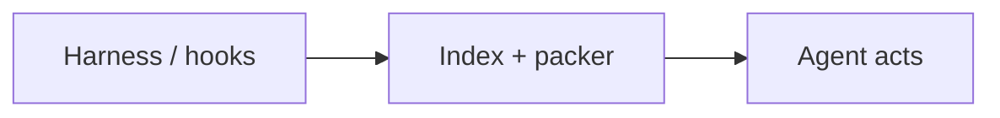

# Architecture

Keep the tape. Check out five records.

A work-context index for coding agents. The session file is append-only. Claims are a rebuildable HEAD. `ask` is checkout: at most five claims so the next turn does not repeat a failed, regress shipped work, or forget the answer. No LLM on retrieve. Age never disqualifies a claim.

[Algorithm](algorithm.md) · [pipeline](pipeline.md) · [write](write.md) · [ask](ask.md) · [retrieval](retrieval.md)

## 1. The loop

Write is push. Read is pull. Intelligence is split: the harness decides when to ask; lossless only packs. The agent obeys warnings.



| Harness | lossless | Agent again |
|---------|----------|-------------|
| Grok, Claude, Codex, Pi, OpenCode | No search string as the product | Read `warnings` first |
| Skill: call `ask` before edits | Work context → candidates → score → pack | Failed → do not repeat without evidence |
| Hooks copy JSONL on compact / stop | Deterministic. Same packet across models | Decision / constraint → do not silently undo |
| Watcher tails if a hook misses | Empty pack is valid | Optional `GET` / `remember` |

## 2. Surfaces

| Door | How | Notes |
|------|-----|-------|
| `POST /v1/ask` | REST on `127.0.0.1:7432` | Main read. Optional `session_id`. |
| MCP `ask` / `remember` / `get_record` | `/mcp` or `lossless mcp` | Same JSON as REST. |
| CLI | `lossless ask\|remember\|catch-up` | Opens the store directly; still writes the tape. |
| `GET /v1/records/:id` | Full claim + covering excerpt | Open the cited page. Dwell. Does not change the last pack by itself. |
| hooks + watch | fail-open, ≤400ms sidecar | Never stall compact. Spool if home is down. |

## 3. Write path

Always on. No query. Catch-up is idempotent by byte cursor. Own ask/remember/get_record I/O is skipped so the store does not ingest its packets.

1. **Copy the session file.** Harness JSONL → owned `raw/project/yyyy-mm/*.jsonl`. Redact on the way in. Seal + zstd after session end.
2. **Excerpts.** Monthly `excerpts-YYYY-MM.sqlite`. ~800–1600 chars. Tool bodies clipped. For GET, not for ask.
3. **Extract claims.** Heuristics only: failed / decision / constraint / state / thread. Hash supersede. Symbols from text + path stems. `jwt` ↔ `jsonwebtoken`.
4. **Index.** FTS5 body, path postings, symbol postings. Optional claim vector if an on-box embedder is attached. Markdown export is source of truth.
5. **remember.** Bypasses heuristics. Still redacted, still on the raw tape under `manual/`. Writes a `remember` action.

## 4. What lives where

SQLite is the index, not the corpus. A laptop can keep raw forever if it is files. It cannot keep one global FTS over every tool body.

| Data | On disk | Grows |
|------|---------|-------|
| Session tape | `raw/…/*.jsonl(.zst)` | Forever. 3–10 GB / 10 years compressed. |
| Claims | `export/…/{id}.md` | Slow. Rebuildable HEAD. |
| Claim index | `index/claims.sqlite` | FTS + postings + vectors + actions. |
| Excerpts | `index/excerpts-YYYY-MM.sqlite` | One file per month. |
| Action tape | `actions` | Last 40 per session. ask / get / remember / warn. |
| Vectors | `claim_vectors` | Optional. Claims only. Model name on the row. |

## 5. Ask algorithm

For You’s contract, not Phoenix: hydrate what this session just did, retrieve from several neighborhoods, score named jobs, pack for coverage, record what was served. p50 < 500ms, p95 < 2s. Hooks stay fast.

1. **Request** — `question`, `goal`, `paths[]`, `project` or `workspace_root`, `session_id?`, `limit_tokens`
2. **Catch-up this session** — store-first. Omitted `session_id` catch-up stored workspace sessions that are behind. A set id uses the stored row, or exact locate. Ingest complete lines first.
3. **Normalize** — project key, tokens, path keys (plus basename), identifier symbols. `library` / `choice` are not symbols. `jwt` is.
4. **Compile if thin** — if no paths and <2 tokens: last user line + pathRE + recent claim paths from the owned session tail. Rich asks are never overwritten.
5. **Hydrate action tape** — last pack ids, GET/remember dwells, last-ask tokens — only on a *continue* (same question, anaphoric thin ask, or same files). A rich ask on a new path is a topic shift: no inherited Redis symbols.
6. **Profile** — `head` if still empty. Else `path` / `ident` / `prose`. Mixes structure vs “sounds like.” Overlap weights do not change.
7. **Candidates ≤ 400** — union, not a scan. HEAD skips FTS and vectors.

| Source | What |
|--------|------|
| FTS | question ∪ goal, OR-quoted, 80 |
| Path | 40 per key, 80 total |
| Symbol | `jose`, `tokenBucket`, `jwt`… |
| Type overlap | failed / decision / constraint |
| Vector kNN | optional, 120, claims only |
| Two-hop | pathless: files the first pass hit |
| Recent faileds | only if the union is empty |
| HEAD caps | 12 failed / 10 decision / 8 constraint |

8. **Dedup + filters** — newest `claim_hash`. Drop older same-path conflicts (Jaccard ≥ 0.35). Drop a decision if a newer same-path failed shares topic (≥ 0.2). Filters, not scores.
9. **Features + score** — type, recency (half-life by type; constraint = 1), path/symbol Jaccard, min-max BM25, cosine, agree, graded overlap, dwell, served, OON. Stat mtimes on the current top 30 only. `[verify]` is ephemeral.
10. **Pack ≤ 5** — best failed-overlap first. Then `score − 0.8 × max_sim`. Type cap 2 if another type is uncovered. Diversity Jaccard 0.8. Evict so a job-1 failed cannot lose to the cap.
11. **Emit + record** — warnings cite ids that are in the packet. Then write `ask` / `warn` rows to the tape. Fail-open.

Details and diagrams: [algorithm.md](algorithm.md).

## 6. Score

X’s shape: Σ wᵢ P(actionᵢ). Ours are jobs, not clicks. Weights multiply predicted usefulness, not raw counts.

```
P_fail    = failed_overlap + 0.25 × failed_weak
P_regress = shipped_overlap + 0.24 × shipped_weak
P_answer  = mix(type, path, symbol, bm25, vector, agree, recency)
            × (0.5 if off-path and the caller named files)

score = 4.0 × P_fail
      + 2.5 × P_regress
      + P_answer
      + 0.8 × dwell − 0.9 × served
      − 0.7 × stale
```

| Job | When it fires | If we miss |
|-----|---------------|------------|
| 1 Do not repeat failed | Same path, symbol, ≥2 content tokens, or cosine ≥ 0.55 on a failed | Agent rebuilds the Redis limiter |
| 2 Do not regress shipped | Decision / constraint / state with path, symbol, or tokens | Agent drops jose on the Edge |
| 3 Answer the question | Profile mix. Path 1.8 / ident 1.6 / prose bm25=vector 1.3 | Agent cannot find “why we rejected X” |

Strong overlap (path / symbol / 2 tokens / vector gate) force-packs and warns. One shared word is weak: score only. Recency never drops a candidate. A 10-month constraint still beats a 2-day unrelated failed.

## 7. Action tape

Phoenix represents the viewer as what they did, not a user id. We represent the session as ask / get / remember / warn. The next thin “ok continue” rebuilds the last work cluster. A new session is HEAD.

| Continue — mix the tape | Topic shift — do not inherit |
|-------------------------|------------------------------|
| Same question tokens | Rich ask on a *new* file |
| Thin / anaphoric (“what were we looking at”) | No Redis symbols from last GET |
| Same path cluster as last ask | Off-path P_answer × 0.5 |
| GET dwell boosts that claim | Billing pack is warehouse only |

## 8. Explicitly not

| Not | Why |
|-----|-----|
| LLM on retrieve, HyDE, hosted embeddings | Second agent. Secrets leave the box. Non-deterministic pack. |
| Phoenix / learned ranker on 17 fixtures | Would overfit the bench and hide the jobs. |
| Age gates, 48h windows | A year-old jose is still why we are not using jsonwebtoken. |
| Embedding raw transcripts | Recreates one giant index over forever. |
| Retrieve on every PostToolUse | Noisy and expensive. Ask is a tool call. |
| Mem0-style 50ms religion | Ask may take hundreds of ms if the pack is better. Hooks stay fail-open. |

Local-only by default. Apache-2.0. See [retrieval.md](retrieval.md), [write.md](write.md), [pipeline.md](pipeline.md).
